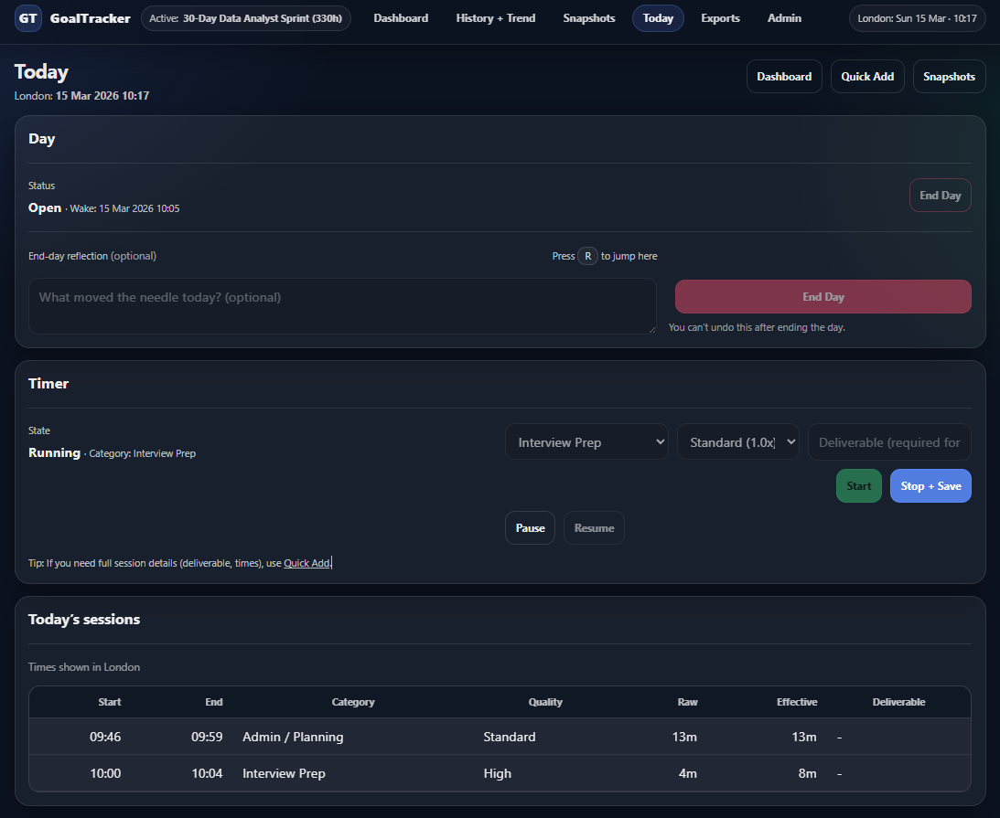
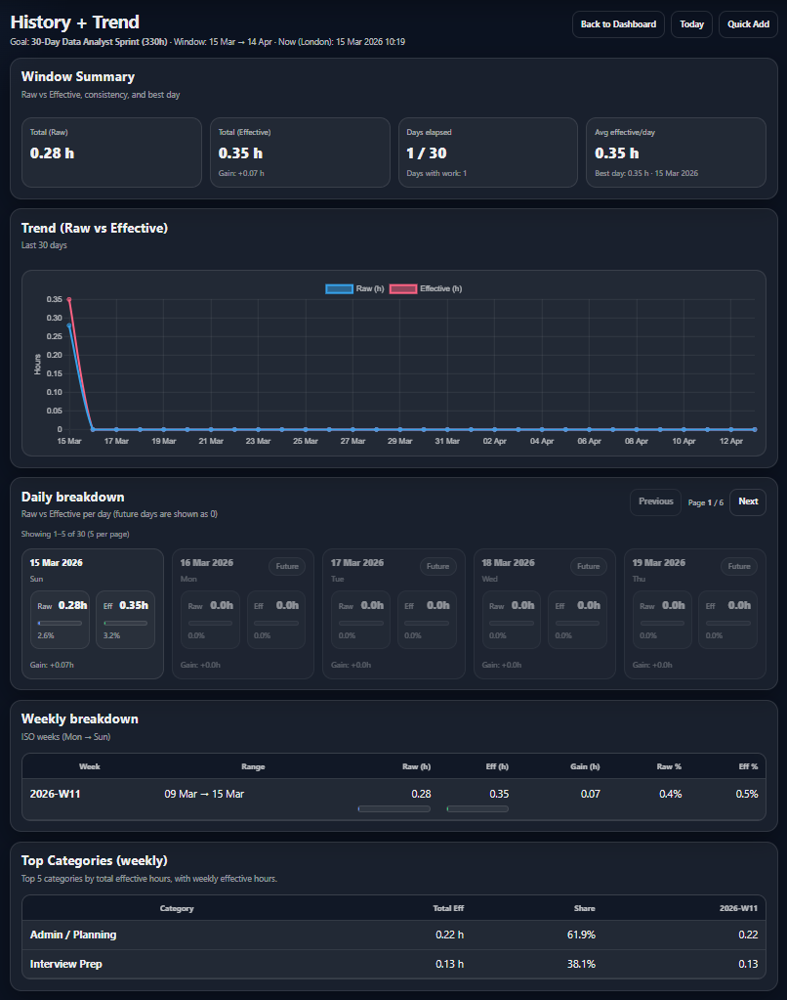
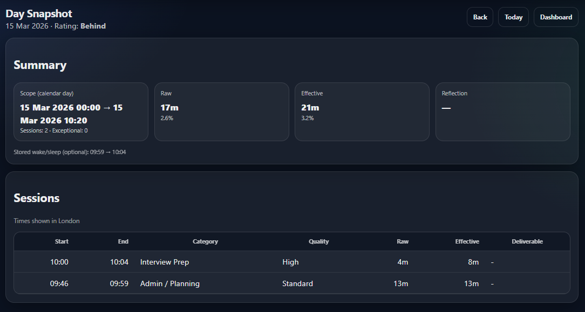
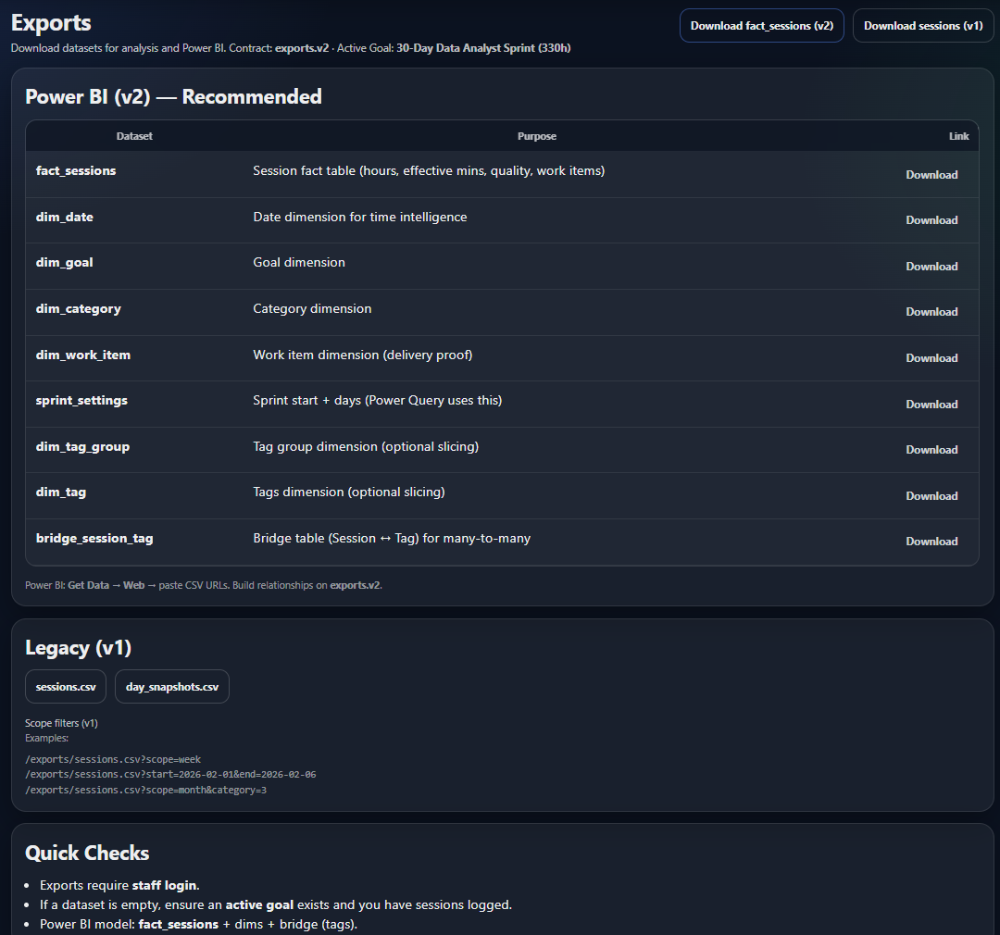

# GoalTracker — KPI Tracking & BI Reporting

> **Session data → quality-weighted KPIs → snapshot reporting → BI-ready outputs**


---

## What This Project Is — and Is Not

Most time-tracking tools stop at logging hours.

**GoalTracker starts there and goes further.**

It is a **KPI-first analytics and reporting system** that captures session-level work data, applies quality-weighted logic to produce *effective minutes*, rolls that activity into persisted daily and weekly snapshots, and publishes structured exports designed for Power BI and downstream BI analysis.

**This is not a habit tracker. It is not a task manager.**

It is a reporting-oriented analytics project built to show how raw operational data becomes a business-interpretable KPI and how that KPI can be delivered through dashboards, snapshots, and BI-ready exports.

---

## The Core Idea: Effective Minutes

The central concept that separates GoalTracker from a simple time logger is **effective minutes**.

Not all logged time is treated as equally valuable. A session completed at high quality contributes more to performance than the same duration completed at low quality. GoalTracker captures this through a **quality multiplier** applied at the session level:

```
Effective Minutes = Raw Duration × Quality Multiplier
```

This single design decision drives the entire KPI model. Every summary, every snapshot, every export is built on this weighted metric — not just a raw time count.

---

## What This Demonstrates

| Capability | Evidence in the project |
|---|---|
| **KPI modelling** | Sessions carry both raw minutes and quality-weighted effective minutes via configurable multipliers |
| **Snapshot reporting** | `DaySnapshot` and `WeekSnapshot` persist reporting summaries — no recalculation at read time |
| **Target vs actual analysis** | Dashboard compares day, week, month, and goal-window progress against a configured target |
| **BI-ready dataset design** | v2 exports follow a fact/dimension-style contract intended for downstream BI tool consumption |
| **Reporting workflow design** | Structured CSV delivery surfaces support downstream analysis in spreadsheets and Power BI |
| **End-to-end proof** | Seed command, snapshot build command, and a `.pbix` proof asset are all included in the repository |

**Best role fit**

`BI Analyst` · `Data Analyst` · `Reporting Analyst` · `Analytics Engineer` · `Python / Django data-product roles`

**Best industry fit**

`Operations Analytics` · `Performance Reporting` · `Internal BI` · `Workforce & Delivery Analytics`

---

## KPI Definitions

These are the metrics GoalTracker tracks, stores, and reports on. They are defined here precisely because KPI definition is itself a core analytical skill this project is demonstrating.

### Raw Minutes
Actual logged minutes between `start_at` and `end_at`. The unweighted source record. Used as a baseline comparison metric but not as the primary KPI.

### Effective Minutes ★
Quality-weighted minutes derived from session duration × quality multiplier. **This is the project's primary KPI.** It models the insight that operational output is a function of both time invested and the quality at which that time was spent.

### Target Minutes
A configured benchmark representing the intended effective minutes for a given reporting window. Serves as the denominator in attainment calculations.

### Attainment %
```
Attainment % = (Effective Minutes ÷ Target Minutes) × 100
```
Calculated and stored at the day, week, month, and goal-window level. The primary performance output surfaced on the dashboard.

### Rating
A human-readable performance label stored on each snapshot (e.g. *On Track*, *Below Target*, *Exceeded*). Designed for manager and analyst consumption — a summary signal without requiring the reader to interpret raw numbers.

### MAE Block
Morning / Afternoon / Evening classification attached to each session. Used to analyse the *distribution* of work across the day, not just the total. Enables pattern analysis across reporting periods.

---

## Data Model

GoalTracker is structured around four layers that move data from raw capture to business-ready output.

```
╔══════════════════════════════════╗
║      OPERATIONAL INPUT LAYER     ║
║                                  ║
║  ActiveDay                       ║  ← Day lifecycle with wake/sleep timestamps
║  ActiveTimer                     ║  ← Single active timer per goal
║  Session                         ║  ← Core record: duration, quality, category,
║                                  ║    work item, MAE block, notes
╚══════════════════╤═══════════════╝
                   │
                   ▼
╔══════════════════════════════════╗
║        KPI LOGIC LAYER           ║
║                                  ║
║  duration_minutes                ║  ← Derived from start_at / end_at
║  quality_level + multiplier      ║  ← Analyst-configured weight per quality tier
║  effective_minutes               ║  ← duration × multiplier  ◀ PRIMARY KPI
║  mae_block                       ║  ← Morning / Afternoon / Evening
║  target_attainment               ║  ← Effective mins vs configured target
╚══════════════════╤═══════════════╝
                   │
                   ▼
╔══════════════════════════════════╗
║         SNAPSHOT LAYER           ║
║                                  ║
║  DaySnapshot                     ║  ← Daily summary: totals, attainment, rating
║  WeekSnapshot                    ║  ← Weekly rollup: aggregated across days
║                                  ║
║  Persisted, not recalculated     ║  ← Snapshots are written records, not views
╚══════════════════╤═══════════════╝
                   │
                   ▼
╔══════════════════════════════════╗
║          DELIVERY LAYER          ║
║                                  ║
║  Dashboard (/)                   ║  ← Headline KPIs, trend views, breakdowns
║  Tracking workflow               ║  ← Operational input surface
║  Snapshot history                ║  ← Historical reporting review
║  CSV exports                     ║  ← Structured delivery for downstream use
║  Power BI proof asset (.pbix)    ║  ← Demonstrated BI consumption
╚══════════════════════════════════╝
```

### Key Models

| Model | Layer | Purpose |
|---|---|---|
| `Session` | Input | Core analytical record — duration, quality, category, work item, MAE |
| `ActiveDay` | Input | Day lifecycle container — wake/sleep timestamps, day status |
| `ActiveTimer` | Input | Live timer driving session creation |
| `DaySnapshot` | Snapshot | Persisted daily summary with attainment and rating |
| `WeekSnapshot` | Snapshot | Persisted weekly rollup across day snapshots |
| `Goal` | Reference | Target configuration and goal window definition |
| `Category` | Reference | Work category taxonomy |
| `WorkItem` | Reference | Individual work item with status and planning metadata |
| `Tag` / `TagGroup` | Reference | Optional tagging taxonomy with session bridge table |

---

## Export & BI Contract

The export layer is a deliberate demonstration of **reporting dataset design** — the shift from *"generate a report"* to *"publish a stable, reusable dataset."*

### Legacy exports

| File | Contents |
|---|---|
| `sessions.csv` | Full session log with all enriched analytical fields |
| `day_snapshots.csv` | Complete daily snapshot history |

### v2 Power BI-oriented exports — star schema

| File | Type | Contents |
|---|---|---|
| `fact_sessions.csv` | **Fact** | Session-level records with all KPI fields and dimension keys |
| `dim_goal.csv` | Dimension | Goal configuration and window metadata |
| `dim_category.csv` | Dimension | Category reference data |
| `dim_work_item.csv` | Dimension | Work item reference with status |
| `dim_date.csv` | Dimension | Date spine for time-intelligence analysis |
| `sprint_settings.csv` | Reference | Sprint and goal window configuration |

Tag dimension and bridge tables are available as optional exports for full taxonomy analysis.

The v2 contract is designed to support direct loading into Power BI with minimal downstream reshaping. Column naming and relationship intent are defined consistently across the export contract.

---

## Product Surfaces

### Recommended review order

| Step | Route | What to look for |
|---|---|---|
| **1** | `/` | KPI dashboard — target vs actual, raw vs effective, category breakdown, pace |
| **2** | `/tracker/today/` | Tracking workflow — day lifecycle, timer, session capture, quality input |
| **3** | `/snapshots/history/` | Snapshot history — persisted daily and weekly reporting outputs |
| **4** | `/snapshots/day/<day_key>/` | Day snapshot detail — per-day performance breakdown and sessions |
| **5** | `/exports/` | Export hub — legacy and v2 CSV surfaces |
| **6** | `proof_pack/powerbi/GoalTracker_Phase5.pbix` | Power BI proof — downstream BI consumption of the export dataset |

---

## Feature Overview

<details>
<summary><b>Tracking Workflow</b></summary>

- Active day lifecycle with wake and sleep timestamps
- Single active timer per goal
- Timer-driven session creation
- Manual session entry flow
- Category and work-item attribution
- Deliverable and notes capture
- MAE block classification
- Immutable session log

</details>

<details>
<summary><b>KPI & Reporting Logic</b></summary>

- Raw vs effective minute modelling
- Daily target comparison
- Goal-window pacing logic
- Day / week / month / window summaries
- Category-level contribution analysis
- Snapshot-based reporting persistence

</details>

<details>
<summary><b>Exports & BI Delivery</b></summary>

- Legacy CSV exports for direct review
- v2 fact/dimension exports for BI workflows
- Stable export contract definitions
- Power BI-compatible reporting structure
- `.pbix` proof asset included in the repository

</details>

<details>
<summary><b>Data Model & Taxonomy</b></summary>

- Goals and categories
- Work items with status and planning metadata
- Tag groups and tags
- Session-to-tag bridge model
- Snapshot history for reporting persistence

</details>

---

## Local Setup

```powershell
# Windows PowerShell

python -m venv .venv
.\.venv\Scripts\Activate.ps1
python -m pip install --upgrade pip
pip install -r requirements.txt

python manage.py migrate
python manage.py seed_demo              # Load demo data
python manage.py build_weekly_snapshot  # Generate weekly reporting snapshots
python manage.py createsuperuser        # Optional: only needed for admin access
python manage.py runserver
```

```powershell
# Verification
python manage.py check
python manage.py test
```

| URL | Surface |
|---|---|
| `http://127.0.0.1:8000/` | KPI dashboard |
| `http://127.0.0.1:8000/tracker/today/` | Daily tracking workflow |
| `http://127.0.0.1:8000/snapshots/history/` | Snapshot history |
| `http://127.0.0.1:8000/exports/` | Export hub |

---

## Project Structure

```
goaltracker-kpi-reporting/
├── apps/
│   ├── dashboard/        # KPI dashboard views — headline metrics and summaries
│   ├── exports/          # CSV export surfaces and v2 BI dataset contracts
│   ├── goals/            # Goal, category, and work item models
│   ├── snapshots/        # DaySnapshot and WeekSnapshot models and views
│   ├── sunrise/          # Active day and timer workflow
│   └── tracker/          # Session capture, logging, and tracking surfaces
├── config/               # Django project configuration
├── static/
├── templates/
├── proof_pack/
│   └── powerbi/
│       └── GoalTracker_Phase5.pbix    ← Power BI proof asset
├── manage.py
├── requirements.txt
└── README.md
```

---

## Portfolio Context

GoalTracker is the **fourth and final flagship project** in a portfolio deliberately designed to cover four distinct data categories:

| # | Project | Data category | Primary focus |
|---|---|---|---|
| 1 | CineScope Analytics | Event / activity data | ETL pipeline, engagement analytics, KPI dashboard |
| 2 | DataBridge Market API | External / API-driven data | Multi-source ingestion, normalised storage, operational visibility |
| 3 | PureLaka Commerce Platform | Transactional business data | Commerce analytics, reporting, operational monitoring |
| **4** | **GoalTracker — KPI Tracking & BI Reporting** | **Internal performance data** | **KPI modelling, snapshot reporting, BI-ready export design** |

Each project is a different answer to the same underlying question: *given a category of data, how do you turn it into something a business can use?*

---

## Role Fit

| Role | Why this project is relevant |
|---|---|
| **BI Analyst** | KPI definition, snapshot reporting, star-schema export design, Power BI-ready datasets, business-facing summaries |
| **Data Analyst** | Target vs actual analysis, category breakdowns, weighted metric modelling, CSV reporting outputs |
| **Reporting Analyst** | Recurring snapshot structure, metric interpretation, export delivery contracts |
| **Analytics Engineer** | Structured metric logic, persisted snapshot layer, fact/dimension export architecture |
| **Python / Django data-product** | End-to-end delivery from operational input through KPI logic to BI-ready output |

---

## Interview Narrative

> *"I built a KPI-first reporting system that captures session-level work activity, applies quality-weighted logic to produce a primary effective-minutes metric, persists that output in daily and weekly snapshots, and publishes a star-schema CSV dataset consumable directly by Power BI. The design goal was not to log time — it was to model operational performance in a way that a BI analyst, reporting analyst, or manager could interpret without needing to understand the underlying data structure."*

---

## Screenshots

### 1 — KPI Dashboard `/`
Target vs actual progress, raw vs effective minutes, goal-window pacing, and category breakdown.


---

### 2 — Daily Tracking Workflow `/tracker/today/`
Active day lifecycle, live timer, quality-level input, and the immutable session log that feeds the KPI model.



---

### 3 — Snapshot History `/snapshots/history/`
Raw vs effective trend chart, daily breakdown cards, weekly breakdown table, and top-category analysis across the goal window.



---

### 4 — Day Snapshot Detail `/snapshots/day/<day_key>/`
Persisted daily summary showing attainment, rating, and the supporting session log with quality and effective minutes visible per row.



---

### 5 — Export Hub `/exports/`
The full v2 Power BI-oriented export contract alongside legacy v1 CSV surfaces, with scope filters and quick-check guidance.



---

## Notes

- Repository is intended for portfolio and review purposes.
- Local demo uses SQLite with fully demo-safe setup commands — no external dependencies required.
- The `.pbix` file is included as a BI proof asset, not a production deliverable.

---

*No license has been added. Add a `LICENSE` file before making this repository publicly reusable.*
